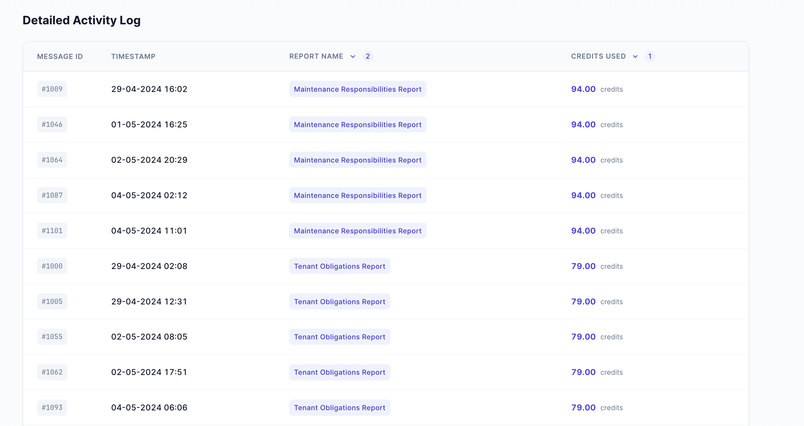

# Orbital Copilot - Usage Dashboard

A simple dashboard to track AI credit usage. Built with React (frontend) and Python FastAPI (backend).

---

## Quick Start

### Option 1: Run with Docker (Recommended)

```bash
docker-compose up --build
```

### Option 2: Run Locally

**Backend:**
```bash
cd backend
pip install -r requirements.txt
python3 main.py
```

**Frontend:**
```bash
cd frontend
bun install
bun run dev
```

### Access the App

| Service  | URL                        |
| -------- | -------------------------- |
| Frontend | http://localhost:5173      |
| Backend  | http://localhost:8000      |
| API Docs | http://localhost:8000/docs |

---

## Screenshots




---

## What Does This App Do?

1. **Shows Usage Overview** - Total credits used, messages processed, and reports generated
2. **Displays Daily Chart** - Bar chart showing credit usage per day
3. **Activity Log Table** - Sortable table with all usage details
4. **URL Sharing** - Sort settings are saved in the URL so you can share them

---

## Tech Stack

### Backend (Python)
- **FastAPI** - Fast web framework
- **httpx** - For making API calls
- **Pydantic** - Data validation

### Frontend (JavaScript/TypeScript)
- **React 19** - UI library
- **Chakra UI v3** - Component styling
- **Recharts** - Charts
- **TanStack Table** - Sortable tables
- **Vitest** - Testing

---

## Project Structure

```
orbital-ai-assignment/
├── backend/
│   ├── main.py           # API server
│   ├── requirements.txt  # Python dependencies
│   └── Dockerfile
├── frontend/
│   ├── src/
│   │   ├── App.tsx       # Main app
│   │   ├── components/
│   │   │   ├── UsageOverview/  # Stats & chart
│   │   │   └── ActivityLog/    # Data table
│   │   └── hooks/
│   │       └── useUsage.tsx    # Data fetching
│   ├── package.json
│   └── Dockerfile
└── docker-compose.yml
```

---

## How It Works

### Backend

1. Fetches messages from external API
2. Calculates credits for each message
3. Returns data as JSON

**API Endpoint:**
```
GET /usage
```

**Response:**
```json
{
  "usage": [
    {
      "message_id": 1,
      "timestamp": "2024-04-29T10:00:00Z",
      "report_name": "Report Name",
      "credits_used": 25.50
    }
  ]
}
```

### Frontend

1. Fetches data from backend
2. Shows overview cards (total credits, messages, reports)
3. Displays bar chart for daily usage
4. Shows sortable table with all records

---

## Running Tests

### Backend
```bash
cd backend
pytest
```

### Frontend
```bash
cd frontend
bun run test
```

---

## Available Commands

### Frontend

| Command | Description |
| ------- | ----------- |
| `bun run dev` | Start development server |
| `bun run build` | Build for production |
| `bun run test` | Run tests |
| `bun run lint` | Check code quality |

### Backend

| Command | Description |
| ------- | ----------- |
| `python3 main.py` | Start server |
| `pytest` | Run tests |

---

## Table Sorting

The activity log table supports sorting:

- **Click once** → Sort ascending (A-Z, low to high)
- **Click again** → Sort descending (Z-A, high to low)
- **Click third time** → Back to original order

You can sort by multiple columns at once. The URL updates automatically so you can share the sorted view.

---

## Key Features

✅ **Overview Cards** - Quick stats at a glance  
✅ **Bar Chart** - Visual daily usage trends  
✅ **Sortable Table** - Click columns to sort  
✅ **Multi-Column Sort** - Sort by multiple columns  
✅ **URL State** - Sorting saved in URL for sharing  
✅ **Responsive Design** - Works on all screen sizes  
✅ **Unit Tests** - 17 tests for frontend components  

---

## Docker Setup

The app uses Docker for easy deployment:

- **Frontend**: Runs on port 5173 (Vite dev server)
- **Backend**: Runs on port 8000 (FastAPI)

Both services are defined in `docker-compose.yml`.

---

## Environment Variables

### Frontend
- `VITE_BACKEND_URL` - Backend API URL (default: `http://localhost:8000`)

---

## Troubleshooting

### Port already in use?
```bash
# Kill process on port 5173
lsof -ti :5173 | xargs kill -9

# Kill process on port 8000
lsof -ti :8000 | xargs kill -9
```

### Docker not working?
```bash
# Rebuild containers
docker-compose down
docker-compose up --build
```

---

## Credits

Built for the Orbital Witness technical assignment.
