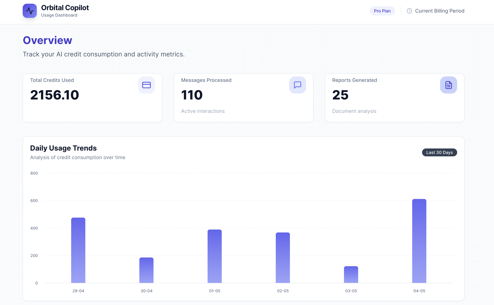
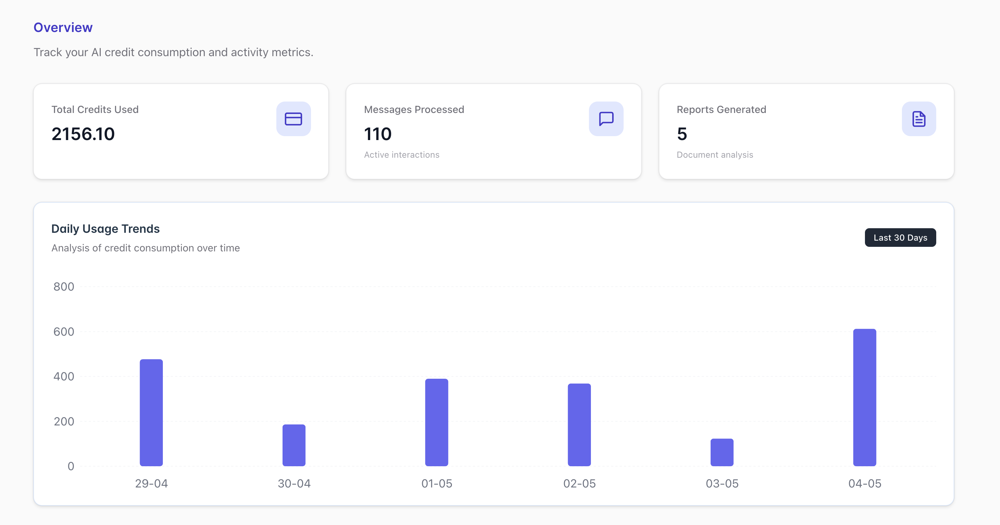

# Orbital Copilot - Usage Dashboard

A full-stack application for tracking and visualizing AI credit usage. Built with React + TypeScript frontend and Python FastAPI backend.

## Quick Start

```bash
# Run with Docker Compose (recommended)
docker-compose up --build

```

| Service  | URL                        |
| -------- | -------------------------- |
| Frontend | http://localhost:5173      |
| Backend  | http://localhost:8000      |
| API Docs | http://localhost:8000/docs |

---






## Table of Contents

1. [High-Level Architecture](#high-level-architecture)
2. [Backend Design](#backend-design)
3. [Frontend Design](#frontend-design)
4. [Trade-offs & Decisions](#trade-offs--decisions)
5. [Production & Scalability](#production--scalability)
6. [Implementation Phases](#implementation-phases)
7. [Deployment](#deployment)
8. [Project Status](#project-status-complete-)

---

## High-Level Architecture

```
┌─────────────────────────────────────────────────────────────────────┐
│                         CLIENT BROWSER                               │
│  ┌─────────────────────────────────────────────────────────────┐    │
│  │              React + TypeScript Frontend                      │    │
│  │  ┌──────────────┐  ┌──────────────┐  ┌──────────────────┐   │    │
│  │  │  Bar Chart   │  │  Data Table  │  │  URL State Mgmt  │   │    │
│  │  │  (Recharts)  │  │  (Custom)    │  │  (React Router)  │   │    │
│  │  └──────────────┘  └──────────────┘  └──────────────────┘   │    │
│  └─────────────────────────────────────────────────────────────┘    │
└─────────────────────────────────────────────────────────────────────┘
                                    │
                                    │ HTTP GET /usage
                                    ▼
┌─────────────────────────────────────────────────────────────────────┐
│                      PYTHON BACKEND (FastAPI)                        │
│  ┌──────────────┐  ┌──────────────┐  ┌──────────────────────────┐   │
│  │  /usage API  │  │ Credit Calc  │  │  External API Client     │   │
│  │  Endpoint    │──│ Service      │──│  (with caching)          │   │
│  └──────────────┘  └──────────────┘  └──────────────────────────┘   │
│                                                │                     │
│  ┌──────────────────────────────────────────────────────────────┐   │
│  │                    PostgreSQL (Optional)                      │   │
│  │              For caching & audit logging                      │   │
│  └──────────────────────────────────────────────────────────────┘   │
└─────────────────────────────────────────────────────────────────────┘
                                    │
                                    │ HTTP GET
                                    ▼
┌─────────────────────────────────────────────────────────────────────┐
│                    EXTERNAL APIs (Orbital Witness)                   │
│  ┌────────────────────────┐    ┌─────────────────────────────────┐  │
│  │ /messages/current-period│    │ /reports/:id                    │  │
│  │ (All messages)          │    │ (Report details)                │  │
│  └────────────────────────┘    └─────────────────────────────────┘  │
└─────────────────────────────────────────────────────────────────────┘
```

---

## Backend Design

### Framework Choice: FastAPI

**Why FastAPI over Flask/Django:**

- Async support out of the box (critical for concurrent external API calls)
- Automatic OpenAPI/Swagger documentation
- Pydantic for request/response validation (ensures strict contract)
- Type hints = better IDE support and fewer bugs
- Lightweight, perfect for this scope

### Project Structure

```
backend/
├── app/
│   ├── __init__.py
│   ├── main.py                 # FastAPI app entry point
│   ├── config.py               # Settings & environment variables
│   ├── api/
│   │   ├── __init__.py
│   │   └── routes/
│   │       ├── __init__.py
│   │       └── usage.py        # GET /usage endpoint
│   ├── services/
│   │   ├── __init__.py
│   │   ├── message_service.py  # Fetch & process messages
│   │   ├── report_service.py   # Fetch report details
│   │   └── credit_calculator.py # Credit calculation logic
│   ├── models/
│   │   ├── __init__.py
│   │   └── schemas.py          # Pydantic models for API contract
│   ├── clients/
│   │   ├── __init__.py
│   │   └── orbital_api.py      # HTTP client for external APIs
│   └── utils/
│       ├── __init__.py
│       └── token_estimator.py  # Token estimation logic
├── tests/
│   ├── __init__.py
│   ├── test_credit_calculator.py
│   ├── test_usage_endpoint.py
│   └── conftest.py             # Pytest fixtures
├── requirements.txt
├── Dockerfile
└── README.md
```

### Key Design Decisions

#### 1. Pydantic Models for Strict Contract

```python
from pydantic import BaseModel, Field
from typing import Optional

class UsageItem(BaseModel):
    message_id: int
    timestamp: str
    report_name: Optional[str] = None
    credits_used: float = Field(..., description="Always rounded to 2 decimals at calculation time")

class UsageResponse(BaseModel):
    usage: list[UsageItem]

# CRITICAL: Use response_model_exclude_none=True at the route level
# to ensure report_name is OMITTED (not null) when None
@app.get("/usage", response_model=UsageResponse, response_model_exclude_none=True)
async def get_usage():
    ...

# Alternative: Manual serialization
# return JSONResponse(content=response.model_dump(exclude_none=True))
```

**Why this matters:** The API contract is strict — multiple teams depend on it. Returning `"report_name": null` instead of omitting the field entirely would break consumers expecting the field to be absent.

#### 2. Async External API Calls with httpx

```python
import httpx
from contextlib import asynccontextmanager
from fastapi import FastAPI

# Lifespan handler for connection reuse (avoids creating client per request)
@asynccontextmanager
async def lifespan(app: FastAPI):
    # Create a single client that will be reused across all requests
    app.state.http_client = httpx.AsyncClient(timeout=30.0)
    app.state.report_cache = {}  # In-memory cache for reports
    yield
    # Cleanup on shutdown
    await app.state.http_client.aclose()

app = FastAPI(lifespan=lifespan)


class OrbitalAPIClient:
    BASE_URL = "https://owpublic.blob.core.windows.net/tech-task"

    def __init__(self, client: httpx.AsyncClient, cache: dict):
        self._client = client
        self._report_cache = cache

    async def get_messages(self) -> list[dict]:
        response = await self._client.get(f"{self.BASE_URL}/messages/current-period")
        response.raise_for_status()
        return response.json()["messages"]

    async def get_report(self, report_id: int) -> dict:
        # Check cache first (reports are semi-static)
        if report_id in self._report_cache:
            return self._report_cache[report_id]

        response = await self._client.get(f"{self.BASE_URL}/reports/{report_id}")
        response.raise_for_status()
        report = response.json()

        # Cache for future requests
        self._report_cache[report_id] = report
        return report

    async def get_reports_batch(self, report_ids: list[int]) -> dict[int, dict]:
        """Fetch multiple reports concurrently with deduplication."""
        import asyncio

        # Deduplicate IDs
        unique_ids = list(set(report_ids))

        # Filter out already-cached reports
        to_fetch = [rid for rid in unique_ids if rid not in self._report_cache]

        # Fetch uncached reports concurrently
        if to_fetch:
            tasks = [self.get_report(rid) for rid in to_fetch]
            await asyncio.gather(*tasks)

        # Return all requested reports from cache
        return {rid: self._report_cache[rid] for rid in unique_ids if rid in self._report_cache}
```

**Why lifespan management matters:** Creating a new `httpx.AsyncClient()` per request adds connection overhead. For 110 messages potentially needing 30+ report fetches, reusing a single client with connection pooling is significantly more efficient.

#### 3. Credit Calculator Service

```python
from decimal import Decimal, ROUND_HALF_UP

BASE_MODEL_RATE = 40
MINIMUM_CREDITS = Decimal("1.00")

def calculate_message_credits(text: str) -> float:
    """
    Calculate credits for a text-based message (no report).

    Uses character-based token estimation as per spec.
    Note: The assignment mentions a "word" definition but explicitly
    specifies character-based calculation: 1 token ≈ 4 characters.
    """
    char_count = len(text)
    estimated_tokens = char_count / 4
    credits = Decimal(str((estimated_tokens / 100) * BASE_MODEL_RATE))

    # Round to 2 decimal places
    credits = credits.quantize(Decimal("0.01"), rounding=ROUND_HALF_UP)

    # Apply minimum AFTER rounding
    return float(max(credits, MINIMUM_CREDITS))


def get_report_credits(credit_cost: int) -> float:
    """
    Get credits for a report-based message.

    Report costs are authoritative from the external API.
    - No minimum applies (if a report costs 0.50, that's valid)
    - Format to 2 decimal places for consistency
    """
    return float(Decimal(str(credit_cost)).quantize(Decimal("0.01")))


def get_credits_for_message(message: dict, report: dict | None) -> float:
    """
    Unified credit calculation for any message type.
    """
    if report:
        return get_report_credits(report["credit_cost"])
    else:
        return calculate_message_credits(message["text"])
```

**Key decisions:**

- Rounding happens at calculation time, not serialization (more reliable)
- Minimum credit (1.00) only applies to text-based messages, not reports
- Using `Decimal` for intermediate calculations avoids floating-point precision issues

**Note on "word" definition:** The assignment defines a "word" as a continual sequence of letters plus `'` and `-`, but then explicitly specifies **character-based** token estimation (1 token ≈ 4 characters). This appears to be legacy text from an earlier version of the spec. We follow the explicit character-based formula as it's the actual calculation requirement. The README should mention this observation to demonstrate awareness of the discrepancy.

### Trade-off: In-Memory Cache vs Database Cache

| Approach                       | Pros                            | Cons                                         |
| ------------------------------ | ------------------------------- | -------------------------------------------- |
| **In-Memory (Chosen for MVP)** | Simple, fast, no extra infra    | Lost on restart, not shared across instances |
| **Redis**                      | Shared cache, survives restarts | Extra infrastructure, overkill for this task |
| **PostgreSQL**                 | Audit trail, persistent         | Slower, more complex                         |

**Decision:** In-memory cache for this task. Reports are semi-static (don't change often), and the dataset is small.

---

## Frontend Design

### Framework & Libraries

| Purpose           | Library                      | Rationale                                |
| ----------------- | ---------------------------- | ---------------------------------------- |
| Framework         | React 19 + TypeScript        | Latest stable version                    |
| Build Tool        | Vite 7                       | Fast dev server, modern defaults         |
| Routing/URL State | React Router v7              | Industry standard, search params support |
| Data Fetching     | TanStack Query v5            | Caching, loading states, error handling  |
| Charts            | Recharts v3                  | React-native, declarative, good docs     |
| Styling           | Chakra UI v2                 | Component library with theming support   |
| Table             | Custom implementation        | Full control over sorting logic          |
| Package Manager   | Bun                          | Fast JavaScript runtime and package manager |

### Project Structure

```
frontend/
├── src/
│   ├── main.tsx
│   ├── App.tsx
│   ├── api/
│   │   ├── client.ts           # Axios/fetch setup
│   │   └── usage.ts            # API hooks (useUsageData)
│   ├── components/
│   │   ├── Dashboard/
│   │   │   ├── Dashboard.tsx   # Main container
│   │   │   └── index.ts
│   │   ├── UsageChart/
│   │   │   ├── UsageChart.tsx  # Bar chart component
│   │   │   └── index.ts
│   │   ├── UsageTable/
│   │   │   ├── UsageTable.tsx  # Data table component
│   │   │   ├── TableHeader.tsx # Sortable header
│   │   │   ├── TableRow.tsx
│   │   │   └── index.ts
│   │   └── ui/
│   │       ├── LoadingSpinner.tsx
│   │       └── ErrorMessage.tsx
│   ├── hooks/
│   │   ├── useUrlSortState.ts  # URL-synced sorting
│   │   └── useMultiSort.ts     # Multi-column sort logic
│   ├── utils/
│   │   ├── dateFormatters.ts   # DD-MM-YYYY HH:mm
│   │   ├── sortUtils.ts        # Sorting functions
│   │   └── chartDataTransform.ts
│   ├── types/
│   │   └── usage.ts            # TypeScript interfaces
│   └── constants/
│       └── index.ts
├── public/
├── index.html
├── package.json
├── tsconfig.json
├── tailwind.config.js
└── vite.config.ts
```

### Key Implementation Details

#### 1. Type Definitions

```typescript
// types/usage.ts
export interface UsageItem {
  message_id: number;
  timestamp: string;
  report_name?: string; // Optional - may be omitted
  credits_used: number;
}

export interface UsageResponse {
  usage: UsageItem[];
}

export type SortDirection = "asc" | "desc" | null;

export interface SortState {
  report_name: SortDirection;
  credits_used: SortDirection;
}
```

#### 2. URL-Synced Sort State Hook (with Precedence Tracking)

The key insight here is that we need to track not just _what_ is sorted and _which direction_, but also the _order_ in which sorts were applied. This is essential for both correct sorting behavior and URL shareability.

```typescript
// hooks/useUrlSortState.ts
import { useSearchParams } from "react-router-dom";
import { useCallback, useMemo } from "react";

type SortColumn = "report_name" | "credits_used";
type SortDirection = "asc" | "desc";

export interface SortEntry {
  column: SortColumn;
  direction: SortDirection;
}

/**
 * URL format: ?sort=report_name:asc,credits_used:desc
 *
 * This preserves BOTH direction AND precedence (order matters!)
 * The first entry is the primary sort, second is secondary tiebreaker.
 */
export function useUrlSortState() {
  const [searchParams, setSearchParams] = useSearchParams();

  // Parse the URL param into an ordered array of sort entries
  const sortOrder: SortEntry[] = useMemo(() => {
    const sortParam = searchParams.get("sort");
    if (!sortParam) return [];

    return sortParam
      .split(",")
      .map((entry) => {
        const [column, direction] = entry.split(":");
        if (isValidColumn(column) && isValidDirection(direction)) {
          return { column, direction } as SortEntry;
        }
        return null;
      })
      .filter((entry): entry is SortEntry => entry !== null);
  }, [searchParams]);

  // Get the current direction for a specific column (for UI indicators)
  const getDirection = useCallback(
    (column: SortColumn): SortDirection | null => {
      const entry = sortOrder.find((e) => e.column === column);
      return entry?.direction ?? null;
    },
    [sortOrder],
  );

  // Toggle sort: null → asc → desc → null (removes from sort order)
  const toggleSort = useCallback(
    (column: SortColumn) => {
      setSearchParams((prev) => {
        const params = new URLSearchParams(prev);
        const currentEntry = sortOrder.find((e) => e.column === column);

        let newSortOrder: SortEntry[];

        if (!currentEntry) {
          // Not sorted → add as ascending (becomes lowest priority)
          newSortOrder = [...sortOrder, { column, direction: "asc" }];
        } else if (currentEntry.direction === "asc") {
          // Ascending → change to descending (maintain position in order)
          newSortOrder = sortOrder.map((e) =>
            e.column === column ? { ...e, direction: "desc" as const } : e,
          );
        } else {
          // Descending → remove from sort order entirely
          newSortOrder = sortOrder.filter((e) => e.column !== column);
        }

        // Update URL param
        if (newSortOrder.length === 0) {
          params.delete("sort");
        } else {
          params.set(
            "sort",
            newSortOrder.map((e) => `${e.column}:${e.direction}`).join(","),
          );
        }

        return params;
      });
    },
    [sortOrder, setSearchParams],
  );

  return { sortOrder, getDirection, toggleSort };
}

function isValidColumn(value: string): value is SortColumn {
  return value === "report_name" || value === "credits_used";
}

function isValidDirection(value: string): value is SortDirection {
  return value === "asc" || value === "desc";
}
```

**Why this design:**

- **Ordered array, not object:** Preserves which sort was applied first (primary) vs second (tiebreaker)
- **URL is single source of truth:** Sharing `?sort=credits_used:desc,report_name:asc` gives identical results
- **Tri-state toggle:** null → asc → desc → null, with removal from the sort order on third click
- **New sorts added at end:** When you click a new column, it becomes the _secondary_ sort, not primary. This is intentional — if you want it primary, click the other column to remove its sort first.

````

#### 3. Multi-Column Sorting Logic (Precedence-Aware)

```typescript
// utils/sortUtils.ts
import { UsageItem } from '../types/usage';
import { SortEntry } from '../hooks/useUrlSortState';

/**
 * Sort usage data respecting the ORDER of sort entries.
 * First entry in sortOrder is the primary sort, subsequent entries are tiebreakers.
 *
 * @param data - The usage items to sort
 * @param sortOrder - Ordered array of sort entries (first = primary)
 * @param originalIndices - Map of message_id to original position (for stable sort)
 */
export function sortUsageData(
  data: UsageItem[],
  sortOrder: SortEntry[],
  originalIndices: Map<number, number>
): UsageItem[] {
  // If no sorts applied, return original order
  if (sortOrder.length === 0) {
    return [...data].sort((a, b) =>
      (originalIndices.get(a.message_id) ?? 0) - (originalIndices.get(b.message_id) ?? 0)
    );
  }

  return [...data].sort((a, b) => {
    // Apply each sort in order (first is primary, rest are tiebreakers)
    for (const { column, direction } of sortOrder) {
      let comparison = 0;
      let forceEnd = false;

      if (column === 'report_name') {
        // Empty/undefined report names sort to the end
        const aName = a.report_name ?? '';
        const bName = b.report_name ?? '';
        const aEmpty = aName === '';
        const bEmpty = bName === '';

        if (aEmpty && bEmpty) {
          comparison = 0;
        } else if (aEmpty) {
          comparison = 1;
          forceEnd = true;
        } else if (bEmpty) {
          comparison = -1;
          forceEnd = true;
        } else {
          comparison = aName.localeCompare(bName);
        }
      } else if (column === 'credits_used') {
        comparison = a.credits_used - b.credits_used;
      }

      // If not equal, apply direction and return
      if (comparison !== 0) {
        if (forceEnd) {
          return comparison;
        }
        return direction === 'asc' ? comparison : -comparison;
      }
      // If equal, continue to next sort entry (tiebreaker)
    }

    // All sort criteria are equal: fall back to original order (stable sort)
    return (originalIndices.get(a.message_id) ?? 0) - (originalIndices.get(b.message_id) ?? 0);
  });
}
````

**Key improvements from original:**

- Uses the _ordered_ `sortOrder` array, not a hardcoded column precedence
- Falls back to original API order when sorts are tied (stable sorting)
- Properly handles empty report names (sort to end, not beginning)

#### 4. Chart Data Transformation (UTC-Consistent)

```typescript
// utils/chartDataTransform.ts
import { UsageItem } from "../types/usage";

interface ChartDataPoint {
  date: string; // Display format: "29-04"
  fullDate: string; // For tooltips: "29-04-2024"
  credits: number;
}

/**
 * Transform usage data into chart-friendly format.
 *
 * IMPORTANT: Uses UTC dates for consistency with table formatting.
 * Both table and chart now bucket by the same date, avoiding timezone
 * mismatches where a message could appear on different dates in each view.
 */
export function transformToChartData(usage: UsageItem[]): ChartDataPoint[] {
  if (usage.length === 0) return [];

  // Group credits by UTC date
  const creditsByDate = new Map<string, number>();

  usage.forEach((item) => {
    // Extract UTC date (YYYY-MM-DD) from ISO timestamp
    const utcDate = item.timestamp.split("T")[0];
    creditsByDate.set(
      utcDate,
      (creditsByDate.get(utcDate) || 0) + item.credits_used,
    );
  });

  // Find date range
  const dates = Array.from(creditsByDate.keys()).sort();
  const startDate = new Date(dates[0] + "T00:00:00Z"); // Parse as UTC
  const endDate = new Date(dates[dates.length - 1] + "T00:00:00Z");

  // Generate all dates in range (including days with zero usage)
  const result: ChartDataPoint[] = [];
  const current = new Date(startDate);

  while (current <= endDate) {
    const dateStr = current.toISOString().split("T")[0]; // YYYY-MM-DD
    const [year, month, day] = dateStr.split("-");

    result.push({
      date: `${day}-${month}`, // X-axis label: DD-MM
      fullDate: `${day}-${month}-${year}`, // Tooltip: DD-MM-YYYY
      credits: Math.round((creditsByDate.get(dateStr) || 0) * 100) / 100, // Round for display
    });

    current.setUTCDate(current.getUTCDate() + 1); // Use UTC to avoid DST issues
  }

  return result;
}
```

**Timezone Decision:**

We chose **UTC everywhere** for consistency:

| Component       | Behavior                               |
| --------------- | -------------------------------------- |
| Table timestamp | Format ISO as UTC: `formatTimestamp()` |
| Chart buckets   | Group by UTC date from ISO string      |
| URL/sharing     | Inherently timezone-agnostic           |

**Trade-off:** Users see UTC times, not local times. For a B2B legal product used across timezones, UTC is actually preferable — it's unambiguous. If local time were required, we'd need to document which timezone and ensure both views use the same conversion.

```typescript
// utils/dateFormatters.ts

/**
 * Format ISO timestamp to DD-MM-YYYY HH:mm (UTC)
 *
 * Using UTC for consistency with chart date bucketing.
 * Alternative: Use Intl.DateTimeFormat with explicit timezone.
 */
export function formatTimestamp(iso: string): string {
  const date = new Date(iso);

  const day = date.getUTCDate().toString().padStart(2, "0");
  const month = (date.getUTCMonth() + 1).toString().padStart(2, "0");
  const year = date.getUTCFullYear();
  const hours = date.getUTCHours().toString().padStart(2, "0");
  const minutes = date.getUTCMinutes().toString().padStart(2, "0");

  return `${day}-${month}-${year} ${hours}:${minutes}`;
}
```

---

## Trade-offs & Decisions

### Backend Trade-offs

| Decision                       | Alternative       | Why This Choice                                             |
| ------------------------------ | ----------------- | ----------------------------------------------------------- |
| **FastAPI**                    | Flask, Django     | Async support crucial for concurrent report fetching        |
| **httpx**                      | aiohttp, requests | Modern, async-native, good API                              |
| **In-memory cache**            | Redis, PostgreSQL | Simple, sufficient for demo, quick to implement             |
| **Decimal for credits**        | float             | Precision matters for billing, avoids floating point errors |
| **Concurrent report fetching** | Sequential        | Major performance win (asyncio.gather for N reports)        |

### Frontend Trade-offs

| Decision              | Alternative                    | Why This Choice                                             |
| --------------------- | ------------------------------ | ----------------------------------------------------------- |
| **Vite**              | Create React App, Next.js      | Fast, modern, no SSR needed                                 |
| **TanStack Query**    | SWR, plain fetch               | Built-in caching, loading states, refetch logic             |
| **Recharts**          | Chart.js, D3, Nivo             | React-native, simple API, good for bar charts               |
| **Custom table**      | AG Grid, TanStack Table        | Full control over tri-state sorting, simpler for this scope |
| **Chakra UI**         | Tailwind CSS, styled-components| Component library with theming, accessibility built-in      |
| **Bun**               | npm, pnpm, yarn                | Fastest JavaScript runtime and package manager              |
| **URL search params** | Context, Redux                 | Shareable URLs requirement, simpler state management        |

### Critical Implementation Decisions

#### 1. Tri-State Sorting (null → asc → desc → null)

The requirement states: "First click sorts ascending, second descending, third returns to original."

**Challenge:** Preserving "original order" after sorting.

**Solution:** Store original indices on data fetch, use them when all sorts are cleared.

```typescript
const [originalIndices, setOriginalIndices] = useState<Map<number, number>>(
  new Map(),
);

useEffect(() => {
  if (data) {
    const indices = new Map<number, number>(
      data.usage.map((item, idx) => [item.message_id, idx]),
    );
    setOriginalIndices(indices);
  }
}, [data]);
```

#### 2. Multi-Column Simultaneous Sorting

**Challenge:** "It should be possible to have sorts applied to both columns at the same time."

**Interpretation Options:**

- A) Sort by column A, then B as tiebreaker (hierarchical)
- B) Apply sorts independently (unclear behavior)

**Decision:** Option A - hierarchical sorting where the **order of clicks determines precedence**.

**Implementation:** Track sort order with an ordered array, not an object:

```typescript
// URL: ?sort=credits_used:desc,report_name:asc
// Means: Primary sort by credits (desc), then by report_name (asc) for ties

const sortOrder: SortEntry[] = [
  { column: "credits_used", direction: "desc" }, // Primary (clicked first)
  { column: "report_name", direction: "asc" }, // Secondary (clicked second)
];
```

**Behavior:**

- First click on a column → adds it to the sort order (ascending)
- Second click on same column → changes to descending (keeps position)
- Third click on same column → removes it from sort order entirely

This ensures the URL `?sort=credits_used:desc,report_name:asc` can be shared and will produce identical results for any user.

#### 3. Empty Report Name vs Omitted

**Requirement:** "If not a valid report, Report Name column should be empty"

**API Contract:** `report_name?` - optional field, omitted when not present.

**Frontend Handling:**

```typescript
<td>{item.report_name ?? ''}</td>  // Displays empty string if undefined
```

#### 4. Timestamp Formatting

**Requirement:** `DD-MM-YYYY HH:mm` format

**Input:** ISO 8601 `2024-04-29T02:08:29.375Z`

```typescript
function formatTimestamp(iso: string): string {
  const date = new Date(iso);
  const day = date.getUTCDate().toString().padStart(2, "0");
  const month = (date.getUTCMonth() + 1).toString().padStart(2, "0");
  const year = date.getUTCFullYear();
  const hours = date.getUTCHours().toString().padStart(2, "0");
  const minutes = date.getUTCMinutes().toString().padStart(2, "0");
  return `${day}-${month}-${year} ${hours}:${minutes}`;
}
```

**Consideration:** Timezone handling - display in user's local time or UTC? Task shows times that suggest UTC. **Decision:** Use UTC for consistency with chart bucketing.

---


---

## Production & Scalability

For production deployment strategies, scalability considerations, and database architecture, see **[PRODUCTION.md](./PRODUCTION.md)**.

This includes:
- Database schema and migration strategies
- Horizontal scaling approaches
- Caching strategies (Redis, PostgreSQL)
- Multi-tenant support
- Real-time updates with WebSockets
- Monitoring and observability
- Cost optimization

---

## Implementation Phases

### Phase 1: Backend Core ✅

1. ✅ Set up FastAPI project structure
2. ✅ Implement external API client with async + lifespan management
3. ✅ Implement credit calculator with tests (both text and report paths)
4. ✅ Create /usage endpoint with Pydantic models + exclude_none
5. ✅ Add in-memory report caching with batch fetching
6. ✅ Test with real external APIs

### Phase 2: Frontend Core ✅

1. ✅ Set up Vite + React + TypeScript
2. ✅ Implement API client with TanStack Query
3. ✅ Build UsageTable component with UTC formatting
4. ✅ Implement tri-state sorting with precedence tracking
5. ✅ Add URL state synchronization (ordered sort params)
6. ✅ Build bar chart with Recharts (UTC date bucketing)
7. ✅ Integrated Chakra UI for component library and theming

### Phase 3: Polish & Documentation ✅

1. ✅ Styling with Chakra UI (switched from Tailwind)
2. ✅ Loading and error states
3. ✅ README with run instructions (frontend + backend)
4. ✅ Document decisions and trade-offs
5. ✅ Answer reflection questions (see TOKENIZATION_NOTES.md)
6. ✅ Final testing end-to-end
7. ✅ Unit tests with Jest
8. ✅ E2E tests with Cypress

### Phase 4: Docker & Deployment ✅

1. ✅ Simple Dockerfile for backend (uv-based)
2. ✅ Simple Dockerfile for frontend (Bun + Vite preview)
3. ✅ Docker Compose for full stack (no nginx)
4. ✅ Updated documentation with Docker instructions

**Implementation Notes:**
- Removed nginx entirely - frontend uses Vite preview server
- Backend uses `uv` for fast dependency management
- Frontend uses `bun` for fast builds
- Simple docker-compose.yml with just frontend + backend services

---

## Reflection Questions - Prepared Answers

### 1. Why approximate 1 token ≈ 4 characters?

**Answer:** This is a rough heuristic based on how GPT tokenizers work. The OpenAI/Anthropic tokenizers use BPE (Byte Pair Encoding) where common words become single tokens, but rare words get split. On average, for English text, ~4 characters ≈ 1 token works reasonably well.

**Breakdown for Legal Language:**

- Legal text often has long, formal words ("indemnification", "notwithstanding")
- Latin phrases ("inter alia", "pro rata") tokenize inefficiently
- Heavy use of punctuation and formatting
- This means legal text likely uses **more tokens per character** than average
- Our approximation would **undercharge** lawyers, potentially losing revenue

### 2. Different models (GPT-3.5 vs GPT-4) implications?

**Answer:** Would need model-specific rates:

```python
MODEL_RATES = {
    "gpt-3.5-turbo": 20,   # Cheaper
    "gpt-4": 60,           # More expensive
    "gpt-4-turbo": 40,     # Middle ground
    "claude-3-opus": 75,   # Premium
}

def calculate_credits(text: str, model: str) -> float:
    rate = MODEL_RATES.get(model, 40)
    tokens = len(text) / 4
    return max(1.0, round((tokens / 100) * rate, 2))
```

### 3. Improving token estimation in production?

**Answer:** Use the actual tokenizer library:

```python
import tiktoken

encoder = tiktoken.encoding_for_model("gpt-4")

def count_tokens_exact(text: str) -> int:
    return len(encoder.encode(text))
```

For Anthropic: Use their tokenizer or API response metadata which includes actual token counts.

### 4. Caching/batching strategies for slow LLM API?

**Answer:**

- **Write-through cache:** Store token counts when response is received
- **Batch processing:** Queue messages, process in batches during off-peak
- **Predictive caching:** Pre-calculate for common report types
- **TTL-based invalidation:** Cache for 24h, messages don't change

### 5. Normalizing token billing for fairness?

**Answer:**

- **Intent-based pricing:** Simple questions (1x), complex analysis (1.5x), reports (fixed)
- **Confidence discounts:** If AI is uncertain, charge less
- **Subscription tiers:** Heavy users get volume discounts
- **Cap per query:** Maximum charge regardless of length

### 6. Explaining cost differences to lawyers?

**Answer:** Show in UI:

- Token count (or character count)
- Whether it was a report (fixed price) or question (variable)
- Breakdown: "120 tokens × $0.40/100 = $0.48, rounded to $1.00 minimum"
- Comparison to similar queries

**UI Tooltip Example:**

```
Credit Calculation:
├─ Message length: 156 characters
├─ Estimated tokens: 39
├─ Rate: 40 credits per 100 tokens
├─ Calculated: 15.60 credits
└─ Final: 15.60 credits
```

---

## Deployment

### Current Docker Setup (Simplified)

The project uses a simple Docker setup with no nginx:

**Backend Dockerfile:**
- Base image: `python:3.11-slim`
- Package manager: `uv` (fast dependency management)
- Runs: `uvicorn main:app --host 0.0.0.0 --port 8000`
- Port: 8000

**Frontend Dockerfile:**
- Base image: `oven/bun:1.1.45-slim`
- Package manager: `bun` (fast JavaScript runtime)
- Build: `bun run build`
- Runs: `bun run preview` (Vite preview server)
- Port: 5173
- **No nginx** - Vite preview handles both static files and API proxying

**docker-compose.yml:**
```yaml
services:
  backend:
    build: ./backend
    ports:
      - "8000:8000"
    networks:
      - app

  frontend:
    build: ./frontend
    ports:
      - "5173:5173"
    environment:
      - BACKEND_URL=http://backend:8000
    depends_on:
      - backend
    networks:
      - app

networks:
  app:
```

### Running the Application

```bash
# Start both services
docker-compose up --build

# Access the application
# Frontend: http://localhost:5173
# Backend API: http://localhost:8000
# API Docs: http://localhost:8000/docs
```

### Key Design Decisions

1. **No nginx** - Vite preview server handles everything (simpler setup)
2. **Vite proxy** - API requests to `/usage` and `/health` are proxied to backend
3. **Simple ports** - 5173 for frontend (Vite default), 8000 for backend
4. **uv for backend** - Much faster than pip for dependency installation
5. **bun for frontend** - Faster than npm/yarn for JavaScript

---

## Project Status: COMPLETE ✅

All phases have been implemented and tested:

- ✅ Backend API with FastAPI, async/await, credit calculation
- ✅ Frontend dashboard with React, Chakra UI, charts, and tables
- ✅ Multi-column sorting with URL state persistence
- ✅ Docker deployment (simplified, no nginx)
- ✅ Comprehensive documentation (READMEs, planning, tokenization notes)
- ✅ Unit tests (Jest) and E2E tests (Cypress)

### Files Created

```
orbital-ai-assignment/
├── backend/
│   ├── app/
│   │   ├── create_app.py
│   │   ├── routes/
│   │   ├── models/
│   │   ├── schemas/
│   │   ├── utils/
│   │   └── db/
│   ├── main.py
│   ├── pyproject.toml
│   ├── uv.lock
│   ├── Dockerfile
│   ├── README.md
│   └── TOKENIZATION_NOTES.md
├── frontend/
│   ├── src/
│   │   ├── components/
│   │   ├── hooks/
│   │   ├── utils/
│   │   ├── types/
│   │   ├── api/
│   │   ├── schemas/
│   │   └── theme/
│   ├── cypress/
│   ├── package.json
│   ├── Dockerfile
│   └── README.md
├── docker-compose.yml
└── PLANNING.md (this document)
```
